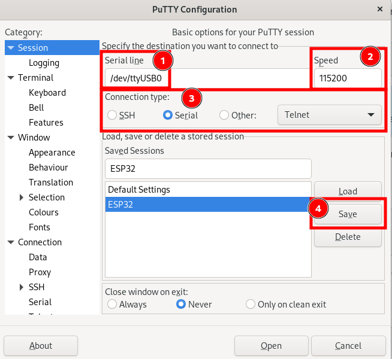
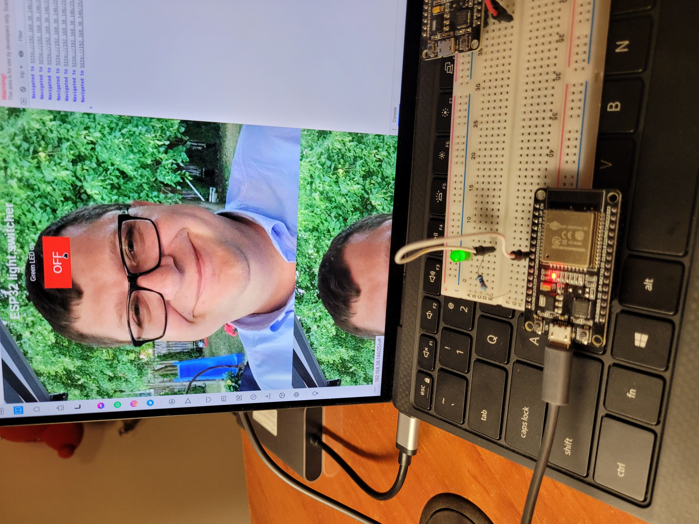
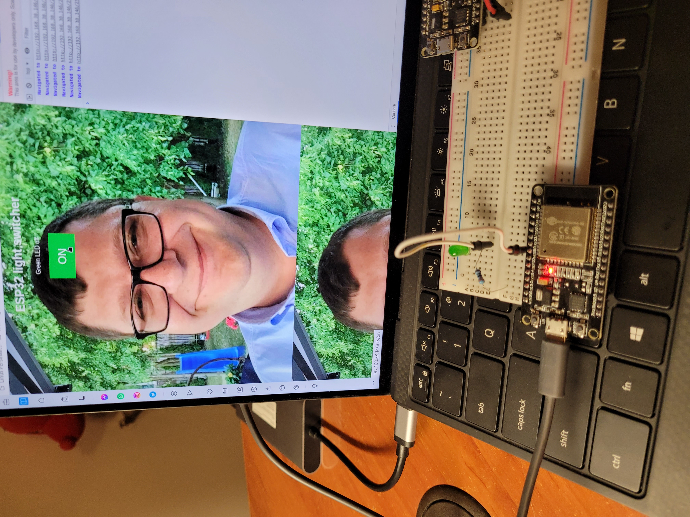

# WiFi LED switcher on ESP32

## Microcontroller and modules

- 1x ESP32 Wroom
- 1x LED
- 1x Breadboard
- 1x male-to-male wire
- 1x resistor 330 Ω

## How to connect elements

1. Green LED to D25 (longer LED pin)
2. Connect LED shorter pins to GND

## How to setup your router and code

You can simply use your phone as a router :smile:

1. Setup your router (you have to know SSID and password so I suggest using WPA/WPA2-Personal security)
2. Input your network SSID and password to code (variables `*ssid` and `*password`)

## How to build and flash code

1. Open project led-blink-webserver in VS Code with PlatformIO extension
2. Wait until PlatformIO setup the project
3. Connect your set to the PC via ESP32 microUSB
4. Click the right arrow on the down panel
5. Wait until the code build and flashes

*Note: You cannot have any active connection on your serial port. Make sure you closed a Putty connection.* :wink:

## Debugging

To debug you can use [Putty](https://www.putty.org). \
Putty configuration: \

*Note: You may have to use Putty as the root user*

## How to use

1. Find the local IP address which ESP received while connecting to WiFi. For example 192.168.1.103
2. Open that address in your browser on the device connected to the same network
3. Click specified buttons to switch on/ off specified LEDs

## Working circuit examples

